# REST API Documentation for the Library Backend System

## User Endpoint APIs

### Endpoint: /api/register/
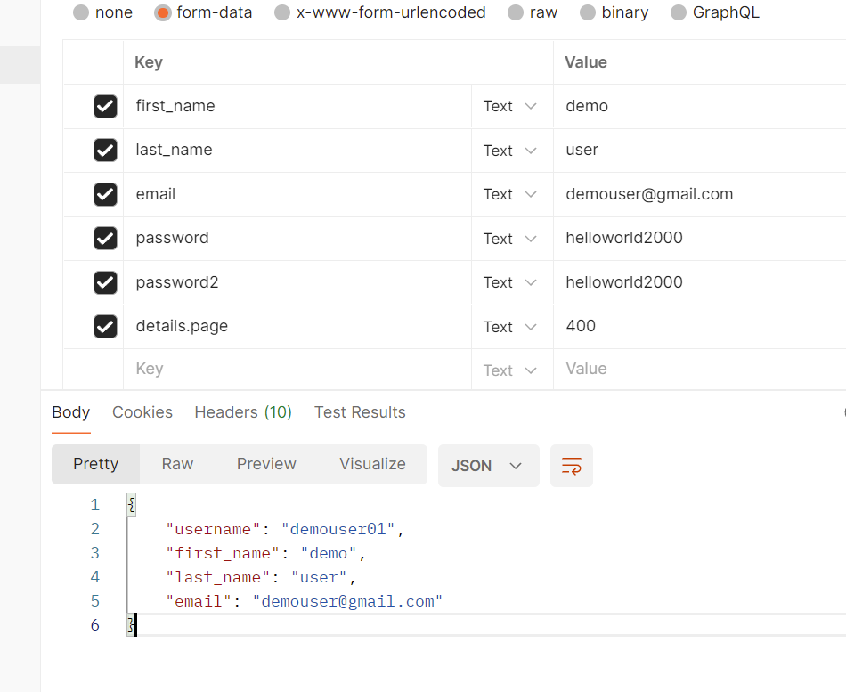
- Type: Post request
- Body: username, first_name, last_name, password, password2, email
- Operation: Creates New User Account

### Endpoint: /api/users/
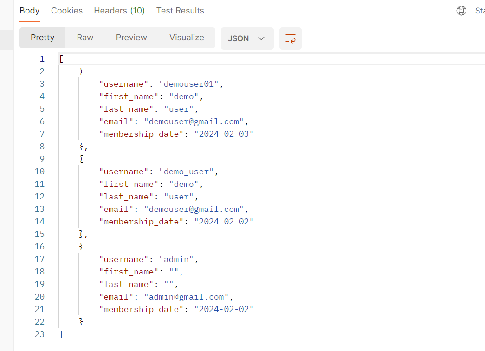
- Type: GET request
- Operation: Returns all Users List

### Endpoint /api/users/user_id/
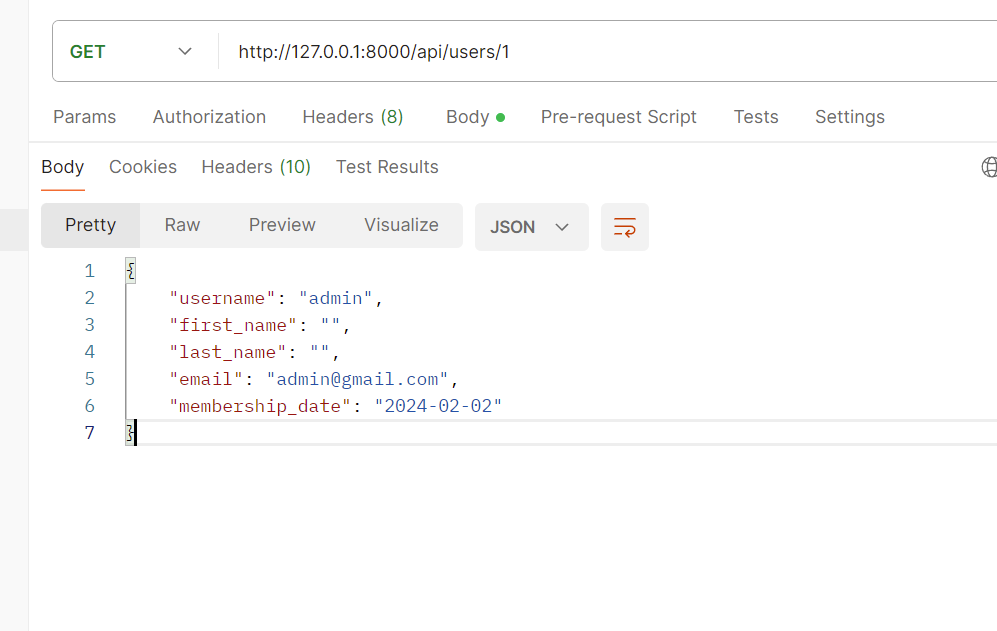
- Type: GET request
- Operation: Returns User Detail for User with user_id

### Endpoint: /api/login/
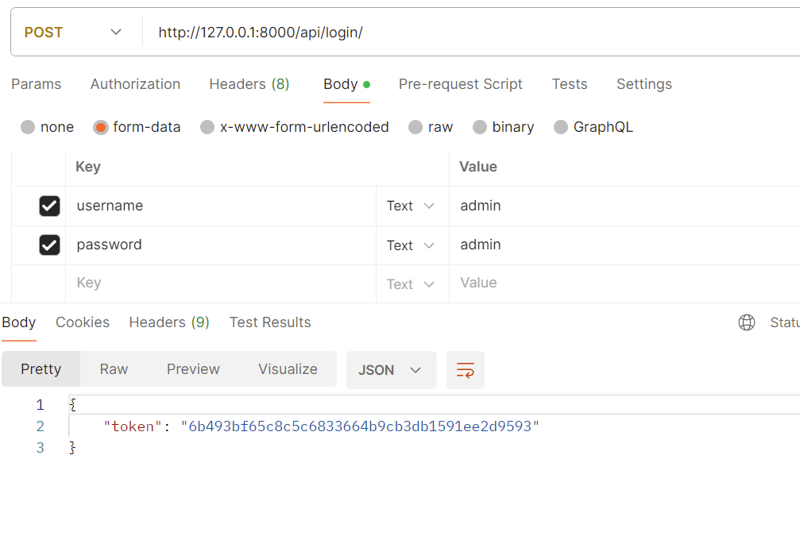
- Type: POST request
- Parameters: username, password
- Operation: Generates and Return Auth Token

### Endpoint: /api/logout/
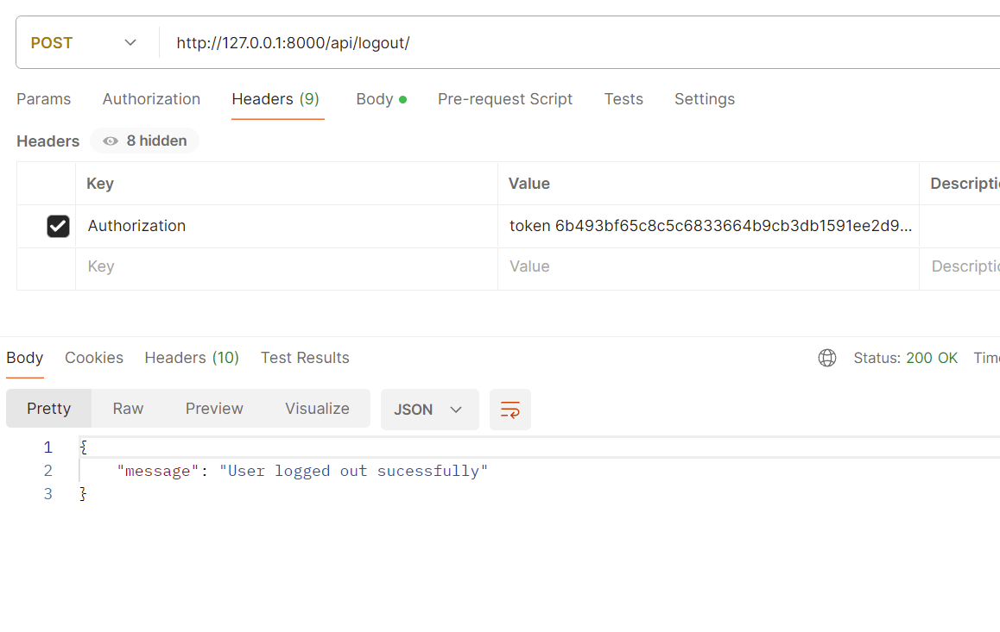
- Type: POST request
- Headers: auth_token
- Operation: Deletes user auth_token

## Book Endpoint APIs

### Endpoint: /api/books/
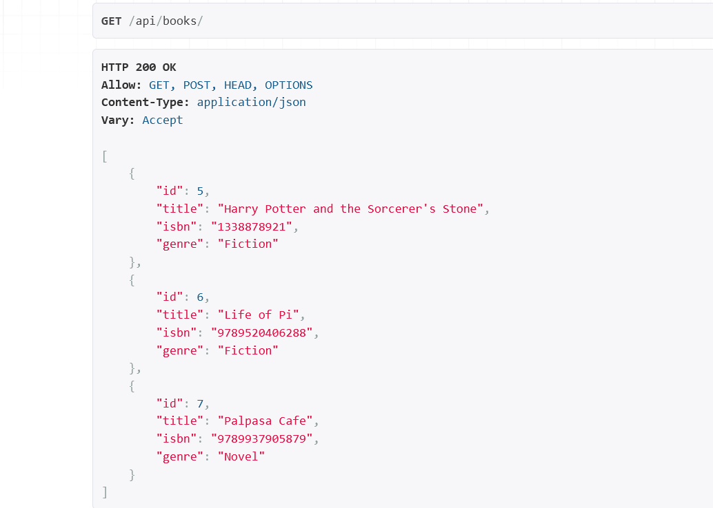
- Type: GET request
- Operation: Returns all Book List

### Endpoint: /api/books/book_id/

- Type: GET request
- Operation: Returns Book Details for Book with book_id

- Type: PATCH request
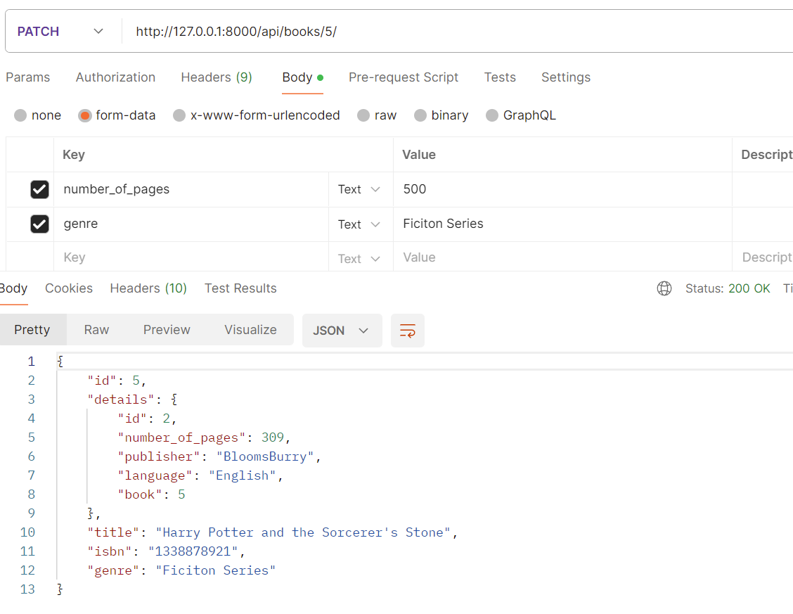
- Headers: auth token required
- Body: Updated Body fields
- Permission: *Request user must be staff/admin
- Operation: Updates Book Data (works for both book model and book details model)

- Type: DELETE request
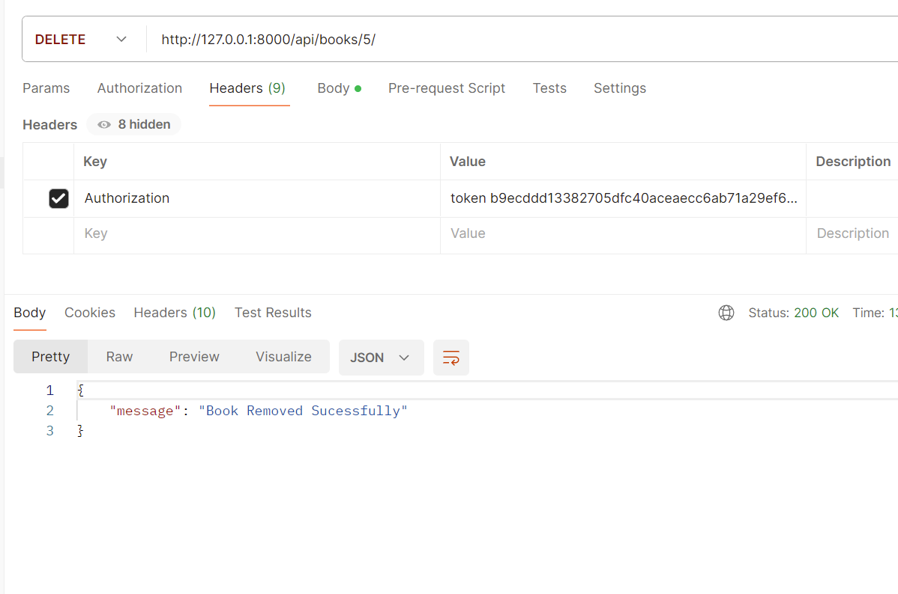
- Headers: auth token required
- Permission: *Request user must be staff/admin
- Operation: Deletes Book and Book Detail Data

## Borrow Endpoint APIs

### Endpoint: /api/borrowed/all
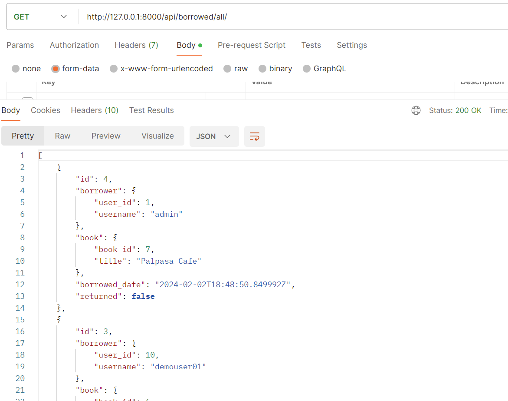
- Type: GET request
- Operation: Returns all Currently Borrowed Books

### Endpoint: /api/borrow/book_id/
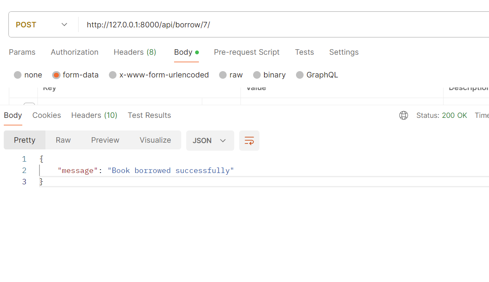
- Type: POST request
- Headers: auth token required
- Operation: Stores Borrowed Book record for request. User and book with corresponding book_id

### Endpoint: /api/borrow/book_id/
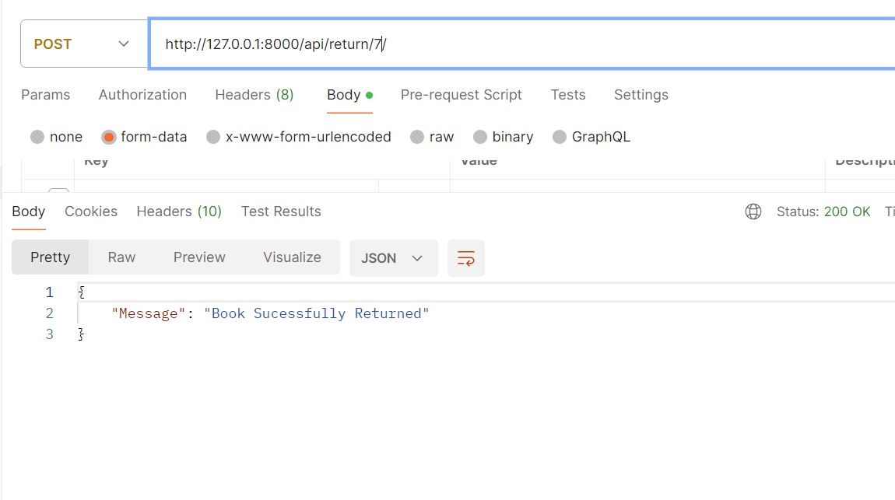
- Type: POST request
- Headers: auth token required
- Operation: Updates Borrowed Book record for request. User and book with corresponding book_id
