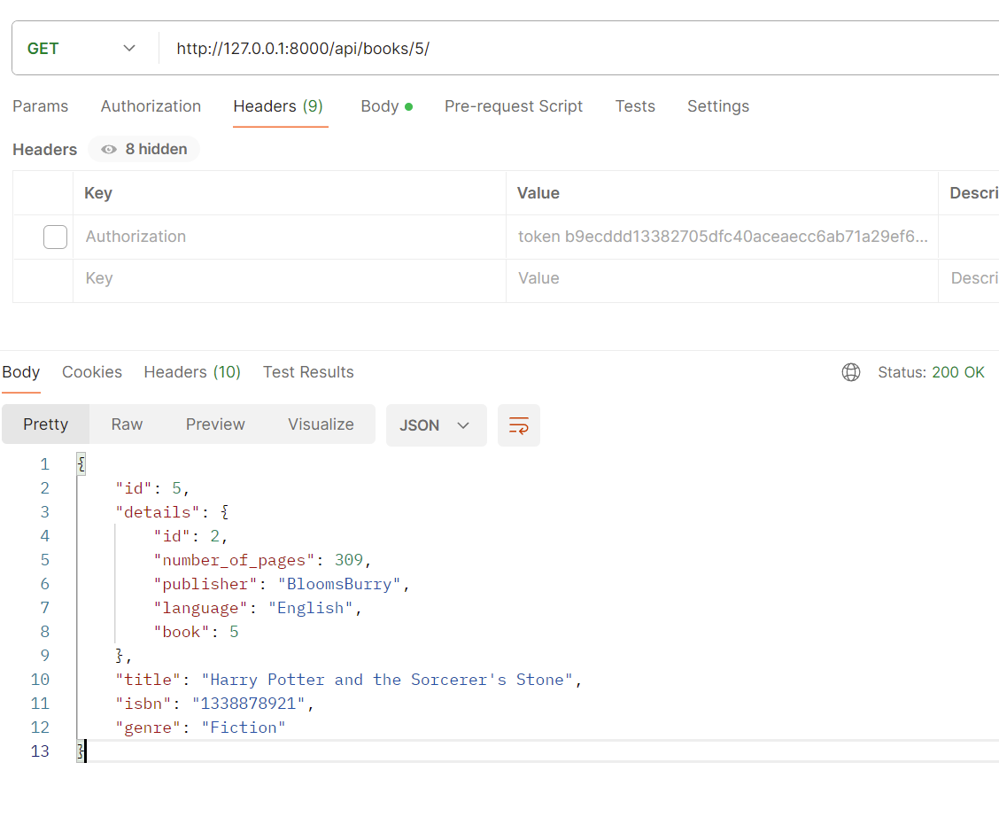

API Documentation

**REST API Documentation** for the Library Backend System

**User Endpoint APIs**
# Endpoint: /api/register/

- Type: Post request
- body: username, first\_name , last\_name , password , password2, email
- Operation: Creates New User Account

# Endpoint: /api/users/

- Type: GET request
- Operation: Returns all Users List

# Endpoint /api/users/user\_id/

- Type: GET request
- Operation: Returns User Detail for User with user\_id

# Endpoint: /api/login/

- Type: POST request
- Parameters: username, password
- Operation: Generates and Return Auth Token

# Endpoint: /api/logout/

- Type: POST request
- Headers:  auth\_token
- Operation: Deletes user auth\_token 

**Book Endpoint APIs**
# Endpoint: /api/books/

- Type: GET request
- Operation: Returns all Book List

# Endpoint: /api/books/book\_id/

- Type: GET request
- Operation: Returns Book Details for Book with book\_id

- Type: PATCH request

- Headers: auth token required
- Body : Updated Body fields
- Permission: \*Request user must be staff/admin
- Operation: Updates Book Data (works for both book model and book details model)

- Type: DELETE request

- Headers: auth token required
- Permission: \*Request user must be staff/admin
- Operation: Deletes Book and Book Detail Data

**Borrow Endpoint APIs**
# Endpoint: /api/borrowed/all

- Type: GET request
- Operation: Returns all Currently Borrowed Books

# Endpoint: /api/borrow/book\_id/

- Type: POST request
- Headers: auth token required
- Operation: Stores Borrowed Book record for request. User and book with corresponding book\_id

# Endpoint: /api/borrow/book\_id/

- Type: POST request
- Headers: auth token required
- Operation: Updates Borrowed Book record for request. User and book with corresponding book\_id

